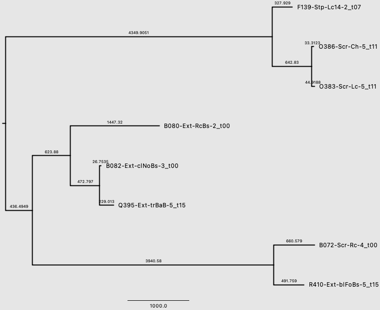

#  Building a database

This tutorial is made to be on run on a small set of files inside the `examples/` directory. In addition, key outputs of this tutorial are available in `examples/output` for you to check your work with.

## 1. Collecting genomes for your species of interest

There are several places you can get genomes for your species of interest, including the NCBI [Genome](https://www.ncbi.nlm.nih.gov/datasets/genome/) and [SRA](https://www.ncbi.nlm.nih.gov/sra) databases. We also recommend the [661K](https://journals.plos.org/plosbiology/article?id=10.1371/journal.pbio.3001421) bacterial genome database, which works to reassign incorrectly labelled genomes found in other public databases. 

PHLAME accepts genomes as either raw sequencing data (.fastq) or assembled genomes (.fasta). However, we recommend supplying genomes as fastq files, as draft assemblies have been [shown](https://journals.plos.org/plosone/article?id=10.1371/journal.pone.0112963) to introduce more variant call errors than alignment from short reads.

We recommend a *minimum* of a dozen genomes to construct a reference database with, although the actual number you need will depend on a variety of factors, including population structure in your species of interest and culturing bias.

PHLAME does not require dereplicating reference genomes before database construction. In fact, we benefit from there being many similar genomes in a database, as it becomes easier to spot individual genomes with sequencing or variant call errors. However, you many want to dereplicate very large genome databases (1000+ genomes) to reduce computational time, especially in the tree-building step.

IMPORTANT: You need to have one reference genome in .fasta format to align all others against (we call this the species-specific reference genome). Ideally, this reference genome should be of higher quality and completeness. This can either be one of the genomes in your database, or a standard type genome for the species (like those found on NCBI [Genome](https://www.ncbi.nlm.nih.gov/datasets/genome/)). 

## 2. Sequence data to candidate mutation table

PHLAME uses a compressed object called a candidate mutation table to store alignment information from many genomes. To create one, we first need to align each of our database genomes to our species-specific reference genome (in .fasta format)

For a snakemake that takes you through the steps of turning sequence data into a candidate mutation table, see `snakemake_makedb`. 

In this tutorial we use the aligners [bowtie2](https://bowtie-bio.sourceforge.net/bowtie2/index.shtml) and [bbmap](https://sourceforge.net/projects/bbmap/#:~:text=BBMap%3A%20Short%20read%20aligner%20for,error%2Dcorrection%20and%20normalization%20tool.), but any alignment software that produces compatible bam files could be used.

### Aligning .fastq files

Installing bowtie2:
```
$ conda install -c bioconda bowtie2
```

Here, we are aligning the database genome `Cacnes_PMH7` against our species-specific reference genome `Pacnes_C1`.We can use bowtie2 to align .fastq files (i.e., raw reads). Note that you only need to run `bowtie2-build` once for every new species. 
```
$ bowtie2-build -q reference_genome/Pacnes_C1.fasta reference_genome/Pacnes_C1_idx

$ bowtie2 -X 2000 --no-mixed --dovetail -x reference_genome/Pacnes_C1_idx -1 data/Cacnes_PMH7R1.fastq.gz -2 data/Cacnes_PMH7R2.fastq.gz -S data/Cacnes_PMH7.sam
```

### Aligning .fasta files 
To align assembled .fasta files, we recommend simulating short reads from your .fasta file first. To do this, you can use `wgsim`, or any other short read simulator.

Installing bbmap:
```
$ conda install -c bioconda wgsim
```

Here, we are using wgsim to simulate 200,000 150bp paired-end reads from a .fasta file in `examples/`
```
$ wgsim -e 0.0 -d 500 -N 200000 -1 150 -2 150 -r 0.0 -R 0.0 -X 0.0 data/Cacnes_PMH5.fasta data/Cacnes_PMH5R1.fastq data/Cacnes_PMH5R2.fastq
$ gzip data/Cacnes_PMH5R1.fastq data/Cacnes_PMH5R2.fastq
```

From here, you can align your files similarly to .fastq files.

### Converting .sam to .bam files
For each aligned .sam file, we use samtools/bcftools to extract just our mutation data in .pileup and .vcf file formats.

Installing samtools and bcftools:
```
$ conda install -c bioconda samtools bcftools
```

First, we use samtools to convert the .sam file to a .bam file (a compressed file format for alignment data)
```
$ samtools view -bS data/Cacnes_PMH7.sam | samtools sort - -o data/Cacnes_PMH7.bam
$ samtools index data/Cacnes_PMH7.bam
$ rm data/Cacnes_PMH7.sam
```

### Counts objects

Because .bam files can be quite large, we convert alignment data from individual genomes into a compressed format called a counts file using the `counts` function in PHLAME. Note that `phlame counts` requires samtools and bcftools installed
```
$ phlame counts -i data/Cacnes_PMH7.bam -r reference_genome/Pacnes_C1.fasta -o data/Cacnes_PMH7.counts
```

### Building the candidate mutation table

Data from many counts files is aggregated into a candidate mutation table. For this, several counts files are already available in `example/counts/`.

You can create a candidate mutation table by specifying the counts files you want aggregated and their corresponding sample names in newline-delimited files. The number and order of sample names should match the number and order of the counts files. 

You can check the [manual](manual.md) or the help option (`phlame cmt -h`) for more options.

```
$ phlame cmt -i counts_files.txt -s sample_names.txt -r reference_genome/Pacnes_C1.fasta -o Cacnes_CMT.pickle.gz
```

## 3. Creating a phylogeny

From a candidate mutation table, we can create a phylogeny and a PHLAME database using the commands `phlame tree` and `phlame makedb`, respectively.

Using the integrated tree-building step requires RaXML installed.
```
$ conda install -c bioconda raxml
```

You can run the integrated `tree` step as follows:
```
$ phlame tree -i Cacnes_CMT.pickle.gz -p Cacnes.phylip -r Cacnes_phylip2names.txt -o Cacnes.tre
```

Alternatively, you can use `tree` to create a PHYLIP formatted alignment file, which plugs into many different phylogenetic inference algorithms.
```
$ phlame tree -i Cacnes_CMT.pickle.gz -p Cacnes.phylip -r Cacnes_phylip2names.txt
```

### Viewing your tree
We recommend visualizing your tree (for example, using [FigTree](https://github.com/rambaut/figtree/releases)) before moving on to the database creation step. Looking at the phylogeny will give important information when making the database, including how many clades there are, what branch length threshold to set, how similar the reference genomes are to one another, and where to root the phylogeny.

Our rooted phylogeny in `example/` looks like this:



At a quick glance, it looks like there are 3 distinct clades in our phylogeny, separated by a minimum branch length of ~623 SNVs. By default, PHLAME will rescale branch lengths into absolute numbers of SNVs when the correlation between the two is sufficiently high (>0.75). 

A key parameter to give to `makedb` is `--min_branchlen`, which defines the minimum branch length for a branch of the phylogeny to be considered a clade. This parameter cannot really be determined a priori, and must be hand-selected after viewing the tree. For the purposes of this tutorial, we will use a minimum branch length of 500 SNVs.

## 4. Making a PHLAME database

Now that we have both our candidate mutation table and our tree, we can run the `makedb` step, which will detect candidate clades in our phylogeny and their corresponding clade-specific mutations. Construction of the actual PHLAME database is done using the `makedb` command. To see the full list of options, check the [manual](manual.md) or the help option (`phlame makedb -h`). 

The phylogeny should be rooted in some way before inputting into the `makedb` step. You can specify `--midpoint` to default midpoint root the phylogeny.

```
$ phlame makedb -i Cacnes_CMT.pickle.gz -t rescaled_Cacnes.tree -o Cacnes_db.classifier -p Cacnes_cladeIDs.txt --min_branchlen 500 --min_leaves 2 --midpoint
```

The two outputs of the `makedb` step are the compressed database and a text file giving the identifies of each clade (`_cladeIDs.txt`). In addition, the number of clade-specific mutations found for each clade are printed to stdout:
```
Reading in files...
Number of core positions: 16280/17491
Getting unanimous alleles...
Getting unique alleles...
Classifier results:
Clade C.1: 3959 csSNPs found
Clade C.1.1: 844 csSNPs found
Clade C.2: 3956 csSNPs found
Clade C.2.1: 1338 csSNPs found
Clade C.2.2: 3526 csSNPs found
```
## 5. Integrating existing strain-level classifications into PHLAME

You can easily integrate existing strain-level classification scheme into a PHLAME database using the `-c` parameter in `phlame makedb`. `-c` takes a text file where each line reports the genome, then the group. This is the same format as the `_cladeIDs.txt` output by PHLAME, see `examples/output/output_Cacnes_cladeIDs.txt` for an example of the format. When you specify -c, PHLAME will only search for SNVs among the clades you define, and will not identify new clades automatically.

```
$ phlame makedb -i Cacnes_CMT.pickle.gz -t rescaled_Cacnes.tree -o Cacnes_db.classifier -p Cacnes_cladeIDs.txt -c Cacnes_cladeIDs_manual.txt --min_branchlen 500 --min_leaves 2 --midpoint
```
