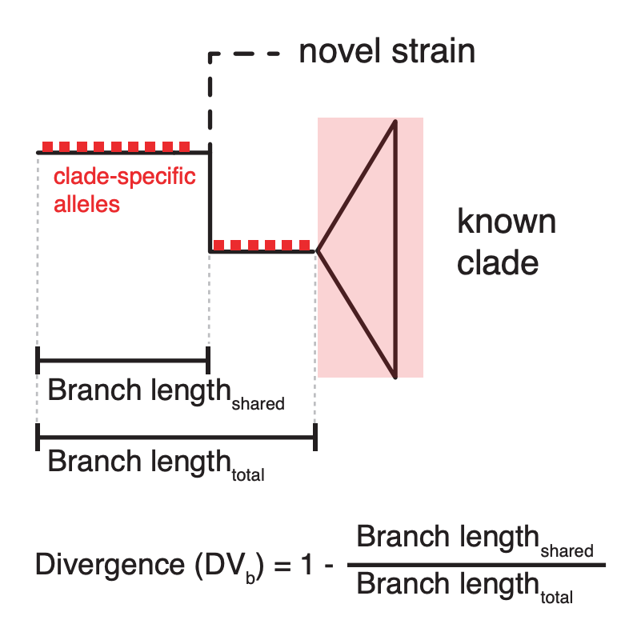
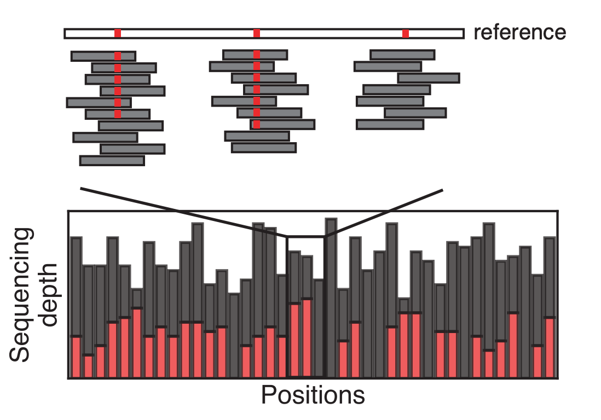
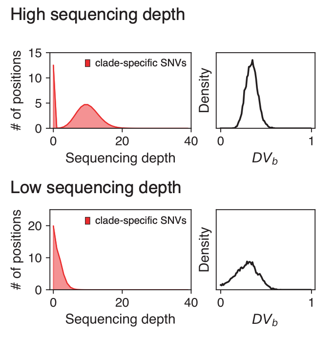

# Conceptual introduction to PHLAME

## Reference databases and Novel diversity

Reference databases are a useful tool to characteize intraspecies diversity in a metagenomic sample, particularly [for sample types](https://www.sciencedirect.com/science/article/pii/S0022202X21023514) that make it difficult to recover genomes directly from metagenomes. A challenge common to all taxonomic reference databases is that they cannot resolve novel diversity not found in the reference database. This issue is particularly prominent when looking at strain-level diversity, as there are only a small number of instances where the *exact* same strains in a reference database are expected to also be a sample. 

Because of the small number of genetic differences between strains of the same species, novel strains risk being reported as combinations of known reference genomes. However, these reference genomes are likely not truly in the sample.

## Divergence (DVb)

Novel strains in a sample are expected to share evolutionary history with the genomes in a reference database up until a certain point, where it diverged from all known strains. We refer to the degree of shared evolutionary history as Divergence (DVb), which is calculated with respect to each branch (b) of the phylogeny. Formally, Divergence is defined as the ratio of shared to unshared branch lengths, and varies from 0 to 1.

We calculate Divergence in metagenomic samples by looking specific marker SNVs that we assume accumulate in a clock-like fashion along a specific branch (we call these clade-specific SNVs). If a strain in a sample is truly a member of a clade, it should have all the clade-specific SNVs leading up to the most recent common ancestor of that clade. A novel strain should share clade-specific SNVs up until it diverged in history with the known strains in that clade. Any clade-specific SNVs past that point should be missing from the sample.

<!--  -->

## Posterior inference of Divergence

At low sequencing depths, it is hard to distringuish the clade-specific SNVs that are truly missing from a sample from those missed by chance. PHLAME uses a Bayesian model to quantify the uncertainty of DV~b~ estimates in a sample. Uncertainty is shown through a posterior probability distribution, where higher values indicate more confidence that DVb is a certain value.

<!--  -->

At higher sequencing depths, the proportion of clade-specific SNVs that are truly missing is more obvious, and this is reflected in a probability distribution that places more probability around a specific value (more confident). At lower sequencing depths, the reverse is true and this is reflected as a more spread-out probability distribution.

Divergence is 

## Classifying metagenomic samples

An important feature of PHLAME is that 
