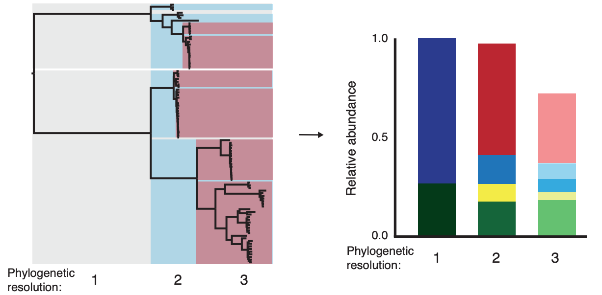
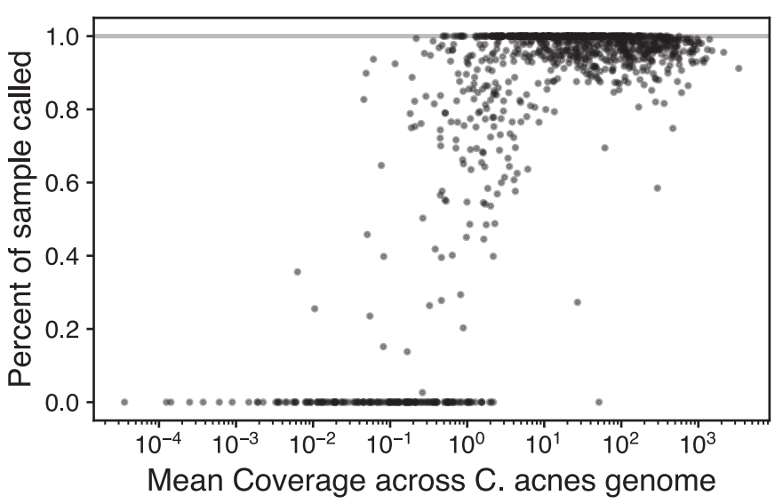

#  Intepreting PHLAME results

## 1. Visualizing classification results

The compressed data file returned by `phlame classify` has useful information that can be used to help visualize classification decisions. You can view the output of a data file with the command `phlame plot`; this is  much more useful when running `-m bayesian`, as you will be able to visualize full posterior distributions over each parameter. For this, a pre-made data file has been included in `example`.

```
phlame plot -f skin_mg_frequencies.csv -d skin_mg_fitinfo_bayesian.data -o skin_mg_frequencies_plot.pdf
```


Each clade will have four relevant plots. From left to right, they are: 
*   [1] A histogram of the actual number of reads supporting each clade-specific allele (red), as well as all alleles at the same positions (gray). 
*   [2] The posterior probability over the pi parameter (equivalent to DVb), as well as the 95% highest posterior density interval (gray bar). 
*   [3] The posterior probability over lambda , which represents the average read depth across 
*   [4] The posterior probability density over the relative abundance of the clade in the sample.

In this particular example, The posterior densities all have fairly high spreads because the sequencing depth is low. Visualizing the posterior densities helps us make detection decisions. For example, while clade C.2 is has enough density below our threshold to be detected, very little density is actually centered around pi values of 0. If we wanted to limit our detections to only strains that we think are for sure within the mRCA of C.2, we might reject this detection (for example, via the --hpd threshold in `phlame classify`)


## 2. Analyzing results at specific phylogenetic levels

By default, PHLAME reports results for every clade in the phylogeny simultaneously, including clades that are direct ancestors or descendants of one another. In order to make classic microbiome visualizations like taxonomic bar plots, you need to select a set of non-overlapping clades (a level) to analyze results at.




You can tell PHLAME to classify at only a specific set of clades using the `-l` parameter in `phlame classify`. By default, PHLAME names clades C.1, C.2, C.3 ... starting from the root, and names acquire more breaks as you go towards the tips of the tree (for example, C.2.1 and C.2.2 would be descendants of C.2).

```
$ phlame classify -i data/skinmg_A.bam -c Cacnes_db.classifier -r reference_genome/Pacnes_C1.fasta -o skin_mg_frequencies.csv -p skin_mg_fitinfo.data -l 'C.1,C.2'
```

If you want to name your clades something else, you can also tell PHLAME to classify using a cladeIDs file (this is the same type of file output by `phlame makedb`). 

```
$ phlame classify -i data/skinmg_A.bam -c Cacnes_db.classifier -r reference_genome/Pacnes_C1.fasta -o skin_mg_frequencies.csv -p skin_mg_fitinfo.data -l Cacnes_cladeIDs_customnames.txt
```

The frequencies of every clade at a specific phylogenetic level may sum to less than 1, which may indicate the presence of uncharacterized or novel clades in the sample. Generally, values below 1 are more common at more-finely resolved phylogenetic clades because you are less likely to fimd that specific clade in a random metagenomic sample. 

In rare cases, total frequencies may sum to a value above 1, as the frequency of each clade is calculated independently. To address this, we recommend normalizing such cases down to 1.

One useful way to analyze PHLAME results is using a Coverage versus Percent Called plot. In this plot, the total inferred frequency of a sample at a specific phylogenetic level is plotted against the mean coverage of that sample. As you can see coverage decreases, PHLAME becomes less confident about individual calls and therefore confidently assigns less of the sample. 

You might notice a few samples with high coverage that still have a lower percent assigned. These samples often harbor uncharacterized or novel clades, and are good candidates to investigate more thoroughly using the `phlame plot` command.

