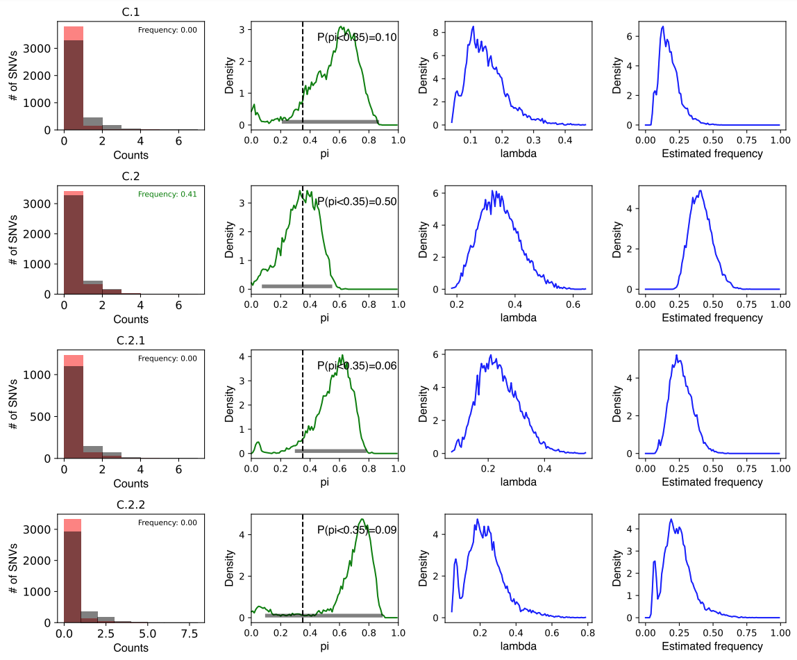

### 3. Visualizing classification results

The compressed data file has lots of useful information that can be used to help visualize detection decisions. You can view the output of a data file with the command `phlame plot`; this is generally much more useful when running the bayesian version of the classify step, as you will be able to visualize full posteriors over each parameter. For this, a pre-made data file has been included in `example`.

```
phlame plot -f skin_mg_frequencies.csv -d skin_mg_fitinfo_bayesian.data -o skin_mg_frequencies_plot.pdf
```



Each clade will have four relevant plots. From left to right, they are: [1] A histogram of the actual number of reads supporting each clade-specific allele (red), as well as all alleles at the same positions (gray). [2] The posterior probability over the pi parameter (equivalent to DVb) in green, as well as the 95% highest posterior density interval (gray bar). [3] The posterior probability over the lambda (rate) parameter and [4] The posterior probability density opver the relative abundance of the clade in the same. In this particular example, The posterior densities all have fairly high spreads because the sequencing depth is low. Visualizing the posterior densities helps us make detection decisions. For example, while clade C.2 is has enough density below our threshold to be detected, very little density is actually centered around pi values of 0. If we wanted to limit our detections to only strains that we think are for sure within the mRCA of C.2, we might reject this detection (for example, via the --hpd threshold in `phlame classify`)
